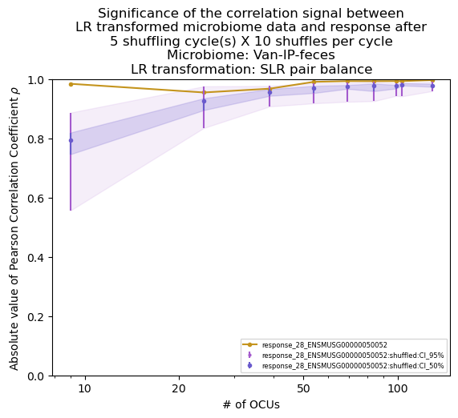
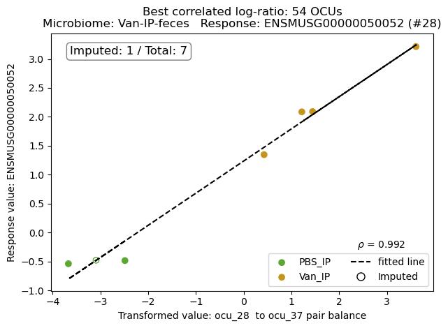
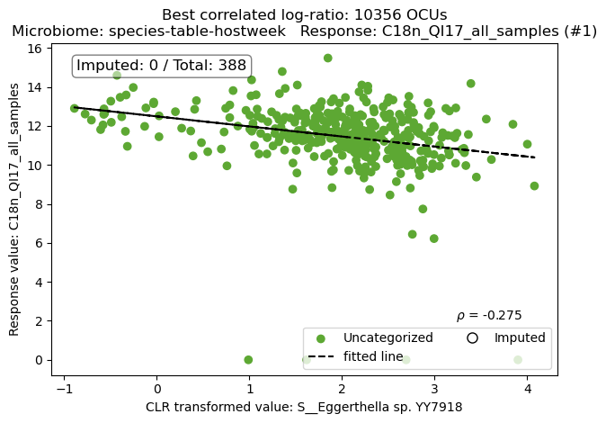
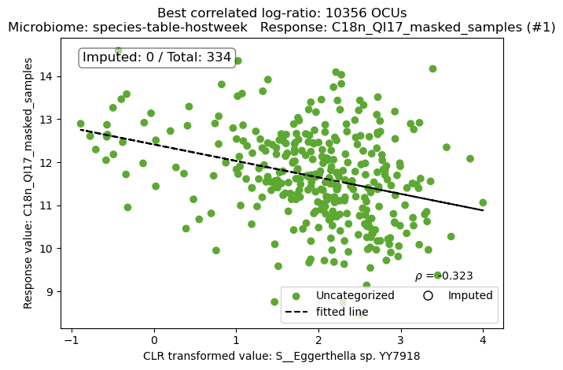

# CompoRes Package


`CompoRes` package is an algorithmic package designed to analyze the connection between changes in the host’s microbiota
and the host’s response (e.g., gene expression, changes in the microenvironmental parameters). It addresses two
significant analysis challenges: compositional statistics in the microbiota and multiple hypothesis testing that
results in false correlations between microbiota and host.

## Contents

1. [Quick Start Guide](#quick-start-guide)
    - [Set Up Environment (development)](#set-up-environment-development)
    - [Configuration File Usage](#configuration-file-usage)
    - [Run](#run-development)
    - [Output overview](#output-overview)
2. [Computational Requirements](#computational-requirements)
3. [Runtime Tips](#runtime-tips)
4. [Package Structure](#package-structure)
   - [Preprocessing](#preprocessing)
   - [Computational Module Overview](#computational-module-overview)
   - [OTU Tracing](#otu-tracing-and-analysis)
   - [Synthetic Analysis](#synthetic-power-analysis)
5. [Configuration File Structure and Naming Conventions](#configuration-file-structure-and-naming-conventions)
6. [Input Files](#input-files-formatting)
   - [Microbiome Files](#microbiome-file-appearance)
   - [Response Files](#response-file-appearance)
   - [Metadata Files](#metadata-file-appearance)
7. [Advanced Features](#advanced-features)
    - [Outlier Detection](#outlier-detection-and-removal)
    - [OTU Analysis](#otu-wise-cumulative-p-value-tracing-and-analysis)
    - [Classification Analysis](#binary-classification-power-analysis-process)
    - [Logging](#logging)


## QUICK START GUIDE

### SET UP ENVIRONMENT (development)

- Fork the repository;
- Clone the repository locally;
- Check `conda` or `mamba` installation on your machine (works much faster and more reliably in most cases);
- Run environment creation with `conda` or `mamba`:

```
conda env create --file {folder}/env/compores_env.yml
conda activate compores_env
```

Note: Replace `{folder}` with the path to your `CompoRes` folder.

[Back to Contents](#contents)

### CONFIGURATION FILE USAGE
Configuration file path should be provided as a positional argument when running the `CompoRes` package.

1. Create a configuration file: see the default `config/config.yaml` example in the repository.
2. Update the experiment parameters (`GROUP1`, `GROUP2`, ...), see explanations below.
3. Change the paths to the input data directories as desired.
    1. microbiome
    2. response
    3. metadata (optional; if no file is provided, the value should be an empty string)
4. Optional: change other parameters as desired.

NOTE: If the configuration file is not provided, the package will use the default configuration file and
will perform a test run with the provided artificial experiment data.

[Back to Contents](#contents)

### RUN (development)

For a test run on synthetic experiment data, execute the following commands in the terminal:

```bash
cd src

python -m compores 
```

To run the package on your data, execute the following commands in the terminal:

```bash
cd src

python -m compores --config {path_to_config_file}
```

To run only the preprocessing step, the OTU clustering included, on your data, execute the following commands:

```bash
cd src

python -m compores --config {path_to_config_file} --preprocess
```

Note: Sometimes the `src` and `src/compores` directories are not recognized, so one needs to make sure it is
on the python path, e.g., for a unix-like OS:

```bash
export PYTHONPATH="${PYTHONPATH}:/path/to/your/compores/directory/src"
```

[Back to Contents](#contents)

### RUN (when the published package is available)

To install the package:

```bash
pip install compores
```

For a test run with the provided synthetic experiment data:

```
compores
```

To run the package on your data:

```
compores --config {path_to_config_file}
```

To run only the preprocessing step, which includes all preliminary processing up to and including OTU clustering:

```
compores --config {path_to_config_file} --preprocess
```

[Back to Contents](#contents)

### OUTPUT OVERVIEW

The output of the `CompoRes` package is saved in the `compores_output` directory.
The basic structure of the output directory is as follows:

- `preprocessed_samples`: contains initial microbiome and response data,
  filtered to include only samples present in both datasets.
- `preprocessing_results`: contains the preprocessed microbiome and response data,
  with preprocessed microbiome and response data, fastspar calculations, and OCU clustering results, including
  `imputed_samples_dictionary.json` and `ocu_clustering_dictionary.json` dictionaries.
- `balance_calculation_results`: contains the results of the balance calculations over OCU clustering on a response
  feature basis.
- `compores_basic_results`: various intermediate results stored as `.pkl` or `.parquet` files that are used for
postprocessing and plotting.
- `compores_response_ranking`: contains response ranking based on the negative sum of log(p-values) of
  correlation coefficients between the response and balances across the OCU clustering for the two cases mentioned: GEV
and permutation testing; ranking files are stored after every shuffling cycle; responses are ordered by the GEV column.
- `plots`: includes `response_vs_best_balance` plots grouped by OCU clusters, `compores_signal_significance`
  plots as depending on OCU number on a response feature basis.
- `logs`: contains log files for the `compores_main` and `compores_compute` modules (see below). 
 
When the `--include_otu_trace_analysis` argument is included, `otu_significance_tracing` directory is created with the
results of tracing OTU significance for every response. For the `CLR` option, single OTUs are traced; if the `pairs`
Coda method is also used, pairwise significance of OTUs in pair balances is traced; corresponding p-values are
summarized across all processed OCU clustering cases; in the latter case, `otu_heatmaps` sub-folder is created within
the `plots` directory for visual tracing of OTU pairwise significance for OTUs in the balances. For more details and
usage, see the `OTU-WISE CUMULATIVE P-VALUE TRACING AND ANALYSIS` section below.

When the `--include_classification_power_analysis` argument is included, the `synthetic_analysis_results` directory is
created with the results of the analysis. For general explanation, see the `PACKAGE STRUCTURE` section above; for
technical details and usage, see the `BINARY CLASSIFICATION POWER ANALYSIS PROCESS` section below.

Additionally, the output directory contains one or two state files: `state_CLR.json` and `state_pairs.json`,
which store the state of the package run; the states include preprocessing, regular run, shuffling cycles, significance
visualization cycles, and OTU tracing and analysis statuses.

[Back to Contents](#contents)


## COMPUTATIONAL REQUIREMENTS

Below we provide practical examples of computational resources which can be provided to various jobs to run the
`CompoRes` package on datasets of varying sizes. These are empirical observations based on the team's experience in
running the full `Compores` pipeline on different datasets: they are indicative only and cannot be considered either
sufficient or necessary conditions for successful execution. Actual resource needs may vary based on specific dataset
characteristics and available computational resources. It is advisable to monitor resource usage and logged outputs
during execution to ensure the package runs smoothly. We highly recommend referring to the [RUNTIME TIPS](#runtime-tips)
section for additional guidance on optimizing run time and resource allocation.

| Dataset Size                                | mem-per-cpu | CPU | `OCU_SAMPLING_RATE` | Shuffles in total |
|---------------------------------------------|-------------|-----|---------------------|-------------------|
| <100 samples, <200 OTUs, <300 responses     | 16GB        | 16  | 15                  | 50                |
| 100-500 samples, ~10000 OTUs, <30 responses | 48GB        | 12  | 200                 | 50                |


[Back to Contents](#contents)

## RUNTIME TIPS

1. **Memory Management**
   - Raise `OCU_SAMPLING_RATE` for large datasets with large number of OTUs.
   - Use `--preprocess` flag for initial data exploration.

2. **Signal Significance Estimation**
   - Adjust `SPARCCKIT_MAX_ITER` based on dataset size.
   - Explore `OUTLIERS_REMOVAL` mode for datasets with potential outliers.
   - Check p-value ranking stabilization across shuffles and adjust number of `SHUFFLE_CYCLES` accordingly.

    
Note: `CompoRes` parallelizes core computations across available CPU cores and processes responses in batches of 30.

[Back to Contents](#contents)


## PACKAGE STRUCTURE

### Preprocessing

The `Preprocessor` class handles the preparation of microbiome and response data for the core analysis.
It ensures data consistency by performing quality checks, imputation, and normalization. Then, it generates OTU
clustering outputs. It stores preprocessed data, OCU matrices, and clustering metadata in structured directories.
Below is an overview of the preprocessing flow:

#### Input validation
- Verifies the existence of input files and performs sample indices checks: whether there are duplicated sample IDs
(if so, only the first occurrence is kept when `--deduplicate` argument is set to `True`, otherwise an error is raised)
and whether sample IDs are consistent between microbiome and response data (the same unique samples appear in both).
- Checks for numeric data, non-negative values, and minimum required dimensions (3 samples and 3 taxa for microbiome,
3 samples and 1 response variable for response).
- Filters microbiome data by removing columns with insufficient non-zero values.

Note: Currently, the `pairs` balance method (see `Computational module`) supports up to 800 OTUs / OCUs, so
additional check is performed of the number of OTUs in the microbiome data and a warning is raised if the number
of OTUs / OCUs exceeds this limit; the limit is controlled by the `OCU_LIMIT` parameter of the `config` file. Raising
the limit may lead to excessive memory consumption and longer processing times; thus, it is recommended to reduce the
number of responses per job, use higher values for `OCU_SAMPLING_RATE`, and carefully allocate resources when running
the package on larger datasets.


#### Imputation process
For samples having missing values for some taxa, the `CompoRes` package uses imputation method similar to that
presented in Palarea-Albaladejo J, Martín-Fernández JA (2015). zCompositions – R package for multivariate imputation of
left-censored data under a compositional approach. Chemometrics and Intelligent Laboratory Systems, 143, 85–96.
doi:10.1016/j.chemolab.2015.02.019; for documentation on `zCompositions` package see:
https://cran.r-project.org/web/packages/zCompositions/zCompositions.pdf.

For the `CompoRes` package, a sample is considered "imputed" in a specific balance if more than 50% of
its taxa content was imputed. For example, for the case of three taxa [`taxon_1`, `taxon_2`, `taxon_3`] and the
following balance data: [`taxon_1`, `taxon_2`] are in numerator and imputed in [`sample_1`, `sample_3`], [`taxon_3`] is
in denominator and imputed in [`sample_2`], `sample_1` and `sample_3` will be considered imputed in the balance and
`sample_2` will not be considered as imputed.

#### Normalization
Normalization ensures that the microbiome abundance data is scaled so that the sum of all values in each row equals one.

#### Outlier handling
The package includes a procedure for detecting and handling outliers which can manifest themselves in regression
analysis of responses on balances. The procedure is controlled by the `OUTLIERS_REMOVAL` parameter in the config file,
and is applied to the initial microbiome dataset. This ensures keeping a consistent set of samples across all responses,
while preventing extreme response values impact the downstream analysis of the clustered microbiome data. For more
details, see the `OUTLIER DETECTION AND REMOVAL` section below.

#### OTU clustering
The OTU clustering flow includes the following steps:
- Correlation estimation is conducted for the microbiome abundance matrix with a custom implementation of SparCC
algorithm (see [1] Friedman, Alm (2012). Inferring correlation networks from genomic survey data. PLoS Computational
Biology, 8(9), e1002687. https://doi.org/10.1371/journal.pcbi.1002687). The implementation has been optimized to make it
suitable for leveraging the iterative SparCC procedure for larger datasets. The number of SparCC iterations is
dynamically adjusted using an exponential decay function based on the dataset size and the `SPARCCKIT_MAX_ITER`
parameter (see the `config` file example), ensuring optimal runtime performance.
- Correlations between all taxa pairs are converted into a distance matrix, which feeds hierarchical clustering (the
linkage method is set to `average`) to group OTUs into OCUs.
- Clustering cases are sampled with a step defined by OCU_SAMPLING_RATE (see the `config` file example) to dilute
further processing; thus, processed cluster cases start from a total number of given valid OTUs and stop at MIN_OCU_NUM.
- For each clustering, a separate abundance matrix is created by summing the values of grouped OTUs and is stored in
microbiome preprocessing results.
- Several clustering metadata artifacts are generated, including a CSV file listing OCU clusters and their OTU
structure (stored as supplementary to highest response-balance correlation plots), as well as two JSON files: one
containing OTU-wise information on imputed samples and one that details fully the overall set of clusters, their OTU
structure, and OCU-wise information on imputed samples (stored in microbiome preprocessing results).

#### Running only the preprocessing step
You can choose to run only the preprocessing step, which includes all preliminary processing up to and including OTU
clustering. To this end, the `--preprocess` argument should be included when running the package (see the `RUN` section
below). The preprocessing results are stored in the `preprocessing_results` directory within the main output folder.

[Back to Contents](#contents)

### Computational module overview

#### Applying CoDA methods for association quantification
In the computational module `compores_compute`, CoDA methods are implemented for quantifying associations between
microbiome balances and host response variables across OCU clustering cases. For each OCU clustering and CoDA method,
the module evaluates associations with response features and identifies the balances exhibiting the strongest
correlations for downstream analysis. By default, balances are computed using the CLR transformation of the clustered
microbiome data. Optionally, the SLR ('pairs' or 'pairwise') transformation can be enabled via the config file. For
each balance method, p-values of the correlations are estimated (see below).

#### Non-parametric p-value estimation

`CompoRes` includes permutation testing, a non-parametric approach to estimating p-values for observed correlation
coefficients between the response and balances across the OCU clustering. This approach is based on shuffling the
data under the null hypothesis and computing the correlation coefficient for each iteration. The p-value is then
calculated as the proportion of shuffled correlation coefficients that are greater than or equal to the observed
correlation coefficient.

#### Parametric p-value estimation using GEV fitting

While shuffling data (permutation testing) offers a reliable, non-parametric approach to estimating p-values, the
resolution of p-values is constrained by the number of permutations. Thus, e.g., with 1000 permutations, the smallest
non-zero p-value obtained will be 0.001, and multiple tests can return identical empirical p-values, which leads to loss
of information on meaningful differences. A parametric approach, which is based on the Generalized Extreme Value (GEV)
distribution, aims at overcoming this limitation, in estimating p-values for observed correlation coefficients. The
choice of the GEV distribution is motivated by its ability to model extreme values, which is particularly relevant in
the context of the search for the highest correlation coefficient and estimating its statistical significance.

#### Summary of the p-value estimation process for observed correlation coefficients

1. Shuffling the data under the null hypothesis and computing the correlation coefficient for each iteration.
2. Computing p-values, `p_value_bootstrap`, for the observed correlation coefficients using the empirical distribution
of shuffled correlation coefficients.
3. Applying the Fisher z-transformation (`arctanh`) to shuffled correlation coefficients to stabilize variance.
4. Fitting a GEV distribution to the transformed correlation coefficients.
5. Computing the p-value for the observed (unshuffled) correlation coefficient values using the CDF of the fitted GEV:
`p_value = 1 - F_GEV(T_obs)`, where:
    - `T_obs` is the observed correlation value after Fisher z-transformation (`arctanh`),
    - `F_GEV` is the cumulative distribution function (CDF) of the fitted Generalized Extreme Value (GEV) distribution.

NOTE: Applying a parametric approach requires accounting for numerical precision issues / occasional tail behavior of
observed values, which may lead to a zero estimate of the p-value. In case a close-to-zero p-value rises, a correction
is applied: the default method is to define the minimum p-value as 1e-11; other possibility considered during the
development is re-estimating the GEV parameters with the observed value added to the shuffled cases array with a
predefined weight: either immediately or after an attempt to bootstrap the p-value from the already estimated GEV
distribution.

#### Visualization of signal significance
For every response, the significance of the correlation between the response and the best balance as a function of the
OCU number involved is visualized. This is done by plotting the absolute value of the correlation coefficients and
estimated standard deviation against the number of OCUs. The plots are saved to the `plots/compores_signal_significance`
directory. Example plot:



#### Visualization of response vs. best balance
For every clustering case and response, the relationship between the response and the best balance is visualized.
This is done by plotting the response values against the best balance values, along with a linear regression line.
The plots are stored in the `plots/response_vs_best_balance` directory, with subdirectories for every one of the
processed clustering cases. Corresponding metadata artifacts are displayed on the plots. For better usability, the
`plots/response_vs_best_balance` directory also includes a CSV file listing OCU clusters and their OTU structure.
Example plot:



#### Response ranking
The `CompoRes` package ranks response features based on the negative sum of log(p-values) of correlation coefficients
between the response and balances across the OCU clustering for the two cases mentioned: GEV and permutation. The
results are stored in the `compores_response_ranking` directory, with ranking files saved after every shuffling
cycle. Responses are ordered by the GEV estimate column, with the boostrap estimate column next to it. It may be useful
to compare the rankings both across p-value estimate methods and CoDA log-transformation methods to identify responses
that are estimated to be consistently significant across both methods. Note: for highly correlated responses, the
rankings may vary with shuffling cycles as affected by small p-values.

### OTU tracing and analysis
In addition to the analysis of response-microbiome association, `CompoRes` provides an option for OTU significance
analysis, when the most prominent, in terms of their individual contribution to the association with a given response,
OTUs are identified through OTU-wise cumulative p-value tracing. After the regular `CompoRes` run, response-balance
correlation coefficient's p-values are estimated for every balance across every processed OCU case. Then, negative log
p-values, `-log(p)`, are accumulated for every OTU, while applying a per-balance correction for how many OTUs build the
OCUs and, then, normalizing by the total encounter counts across balances. This analysis is performed response-wise.
The results are stored in the `otu_significance_tracing` directory.

The output includes arrays of OTU-wise estimated p-values for both positive and negative associations with corresponding
response. For the `CLR` CoDa case, every OTU is scored positively correlated if the OCU it belongs to is positively
associated with the response and negatively correlated otherwise. For the `pairs` CoDA method case, this, "condensed",
output is derived from 2-D pairwise OTU tracing (for OTU pairs as they appear in numerators and denominators).
Thus, for the `pairs` CoDA case, two types of tracing are performed: 1-D OTU tracing, when the OTU is scored positively
correlated if it appears in the numerator of the pair balance and negatively correlated if it appears in the
denominator; and 2-D OTU pairwise tracing, when every OTU pair is scored based on their joint appearance in the balances.

For technical details and usage, see the
[OTU-WISE CUMULATIVE P-VALUE TRACING AND ANALYSIS](#otu-wise-cumulative-p-value-tracing-and-analysis)
section below.

### Synthetic power analysis

Additionally, the `CompoRes` package provides an option for binary classification power analysis, which is designed to
assess the classification accuracy of synthetic responses generated based on the fitted model of balance and response
correlation. The analysis is performed response-wise: according to the provided response tag, the RMSE values for every
model of the highest correlated balance are fetched for every OCU case processed during the regular CompoRes run. A
number of synthetic responses are generated, correlated and uncorrelated, for every RMSE level. The classification
itself involves re-running the CompoRes package on the original microbiome and the generated synthetic responses.
Followed by an analysis of the synthetic responses classification quality based on the CompoRes results as compared to
the which group the responses come from originally. Classification is performed using a range of p-values derived from
the synthetic data. Each synthetic response is classified as correlated or not based on its p-value. Since the synthetic
responses have known true labels, this enables the generation of ROC curves and the calculation of the AUC. To make the
classification more robust, the whole process is repeated a number of times and the results are averaged. The output is
stored in the `synthetic_analysis_results` directory.

For technical details and usage, see the
[BINARY CLASSIFICATION POWER ANALYSIS PROCESS](#binary-classification-power-analysis-process)
section below.

### Used packages

`CompoRes` package draws inspiration in the `R` `SelBal` package for methods to correlate continuous phenotype with
compositional data.

[Back to Contents](#contents)

## CONFIGURATION FILE STRUCTURE AND NAMING CONVENTIONS

### Configuration File

Configuration file path should be provided as a positional argument when running the `CompoRes` package.

1. Create a configuration file: see the default `config/config_synthetic_data.yaml` example in the repository.
2. Update the experiment parameters (`GROUP1`, `GROUP2`, ...), see explanations below.
3. Change the paths to the input data directories as desired.
    1. microbiome
    2. response
    3. metadata (optional; if no file is provided, the value should be an empty string)
4. Check and change other parameters as desired.

NOTE: If the configuration file is not provided, the package will use the default configuration file and
will perform a test run with the provided artificial experiment data.

### Naming Conventions

#### MICROBIOME FILE NAMES

Microbiome file name have the following naming convention: `{g1}-{g2}-{g3}.tsv`

##### Where:

`{g1}` - `GROUP1`, first treatment parameter, e.g., substance name;

`{g2}` - `GROUP2`, second treatment parameter, e.g., treatment type;

`{g3}` - `GROUP3`, third treatment parameter, e.g., microbial community composition location.

##### Example:

For an antibiotic treatment...

- with Neomycin...
- delivered through IP...
- and the microbial community sampled from the lumen of the small intestine...

...the microbiome file name would be `./Neo-IP-SI_lumen.tsv`.

#### RESPONSE FILE NAMES

Response file names have the following naming convention: `{g1}-{g2}.tsv`.

##### Where:

`{g1}` - `GROUP1`, first treatment parameter, e.g., substance name;

`{g2}` - `GROUP2`, second treatment parameter, e.g., treatment type;

##### Example:

For an antibiotic treatment...

- with Neomycin...
- delivered through IP...

...the response file name would be `./Neo-IP.tsv`.

#### METADATA FILE NAMES

Metadata file names have the following naming convention: `{g1}-{g2}-metadata.tsv`.

[Back to Contents](#contents)

## INPUT FILES FORMATTING

### MICROBIOME FILE APPEARANCE

The microbiome file should be saved as a tab-separated values (`.tsv`) file, with the naming convention mentioned above.

**The file's structure is as follows:**
The first column should contain sample identifiers, every row representing another sample. The file contains abundance
information of respective taxon or group of taxa. Thus, the first row should consist of column titles (taxa
identifiers) separated with a tab; no need in a first column (sample identifiers) title.

### RESPONSE FILE APPEARANCE

The response file should be saved as a tab-separated values (`.tsv`) file, with the naming convention mentioned above.

**The file's structure is as follows:**
The first column should contain sample identifiers, every row representing another sample. The file contains expression
level of the respective gene or group of genes for that sample. Thus, the first row should consist of column titles
(gene or gene groups labels) separated with a tab; no need in a first column (sample identifiers) title.

### METADATA FILE APPEARANCE

The metadata file should be saved as a tab-separated values (`.tsv`) file, with the naming convention mentioned above.

**The file's structure is as follows:**
The first column should contain sample identifiers, every row representing another sample. The file contains
(categorical) data about the samples being from either one or two groups, e.g. `'control'`, `'treated'`. Thus,
the first row should the second column title, `Category`, separated with a tab; no need in a first column (sample
identifiers) title.

[Back to Contents](#contents)

## ADVANCED FEATURES

### OUTLIER DETECTION AND REMOVAL

The outlier detection and removal procedure involves the following steps:
- Samples with response values outside a predefined significance threshold are identified as potential outliers:
  - For datasets with categorical metadata (e.g., 'control' and 'treated' groups), outlier detection is performed
  within each category separately to account for group-specific variations.
  - For datasets without categorical metadata, outlier detection is performed on the entire dataset.
- Then, the basic `CompoRes` computation procedure is applied twice to perform and visually document the regression
analysis of the response on the initial microbiome dataset (currently, based on the `CLR` CoDA method):
  - Once, for the full set of samples;
  - Once, excluding samples identified as outliers (see illustration below, the plots are stored in the plot section of
the `preprocessing_results/outlier_detection` directory; other files stored in the directory are response-wise
`outlier_stats.tsv`, `p_values_{g1}-{g2}.tsv`, and `masked_{g1}-{g2}.tsv`).
- For the two regression cases, slopes of the fitted lines are compared for every response feature with a z-test
implementation for the difference of estimates.
  - If statistically significant slope difference(s) is(are) detected for at least one response feature, the
  outlier removal procedure is applied;
  - otherwise, the outlier removal procedure is skipped.




- Cleaned dataset is stored in the `preprocessing_results` directory and then used for the running the main
`CompoRes` computation procedure across all OTU clustering cases.

NOTE: Bonferroni correction is applied based on the number of response features to adjust p-values for multiple testing,
both when identifying outlier samples and when testing for significant slope differences.

[Back to Contents](#contents)

### OTU-WISE CUMULATIVE P-VALUE TRACING AND ANALYSIS

[To OTU tracing and analysis in Computational module overview](#otu-tracing-and-analysis)

You can choose to add the OTU-based cumulative p-value tracing and analysis to your run, after the regular `CompoRes`
package run. This process is applied to the microbiome data; the results are stored in the `otu_significance_tracing`
directory. The analysis is performed response-wise. A response tag should be provided via the `--response` argument
(can be only the `response_{index}` prefix, e.g. `response_0`, `response_1`, etc.) to specify the response to analyze;
if not provided, the response with the highest resulting correlation ranking is chosen by default. For the provided
response, the OCU clustering results are fetched for every OCU case processed during the regular `CompoRes` run. Then,
the p-values of OTUs (single OTUs in the numerator for `CLR` and OTUs in both numerator and denominator for pair
balances) are aggregated for all processed OCU cases and normalized by the number of OCU cases. Resulting arrays are
stored in the `otu_significance_tracing` directory. In case of the `pairs` CoDA method, the results can be further
analyzed using cluster analysis methods.

To run the package on your data and include the power analysis, proceed to execute the following commands in the
terminal:

```bash
cd src

python -m compores --config {path_to_config_file} --include_otu_trace_analysis True
```

Test bash script designed for the SLURM scheduler to perform a test run with the power analysis:

```bash
#!/bin/bash
#SBATCH --time=24:00:00
#SBATCH -N 1
#SBATCH -c 16
#SBATCH --mem-per-cpu=8G
cd ../compores/src
python -m compores --include_otu_trace_analysis True
```

[Back to Contents](#contents)


### BINARY CLASSIFICATION POWER ANALYSIS PROCESS

[To Synthetic power analysis in Computational module overview](#synthetic-power-analysis)

You can choose to run a binary classification power analysis after the regular CompoRes package run.
This process is applied to synthetic responses, generated based on the fitted model of balance
and response correlation.


The analysis is performed response-wise. A response tag should be provided via the `--response` argument
(can be only the `response_{index}` prefix, e.g. `response_0`, `response_1`, etc.) to specify the response to analyze;
if not provided, the response with the highest resulting correlation ranking is chosen by default. For the provided
response, the RMSE values and fitted regression models are fetched for every OCU case processed during the regular
CompoRes run. `NUMBER_OF_RESPONSES_TO_GENERATE` of two classes are generated, correlated and uncorrelated, for every
model / RMSE level. The classification itself involves re-running the CompoRes package on the original microbiome and
generated synthetic responses, followed by an analysis of the synthetic responses classification quality as compared to
the which group the responses come from originally. The output is stored in the
`synthetic_analysis_results/{response_tag}` directory.

Classification is performed using a range of p-values derived from the synthetic data. Each synthetic response is
classified as significant (correlated) or not based on its p-value. Since the synthetic responses have known true
labels, this enables the generation of ROC curves and the calculation of the AUC, which indicates the classification
accuracy. High AUC scores signify successful classification. The whole process is repeated
`NUMBER_OF_EXPERIMENT_REPEATS` times; the results are averaged to ensure robustness. The results, including a box plot
showing the noise levels of true responses, are saved in the specified directory as
`mean_auroc_vs_noise_pairs_balance_with_noise_analysis.png`:


To run the package on your data and include the power analysis, proceed to execute the following commands in the
terminal:

```bash
cd src

python -m compores --config {path_to_config_file} --include_classification_power_analysis True
```
OR
```bash
cd src

python -m compores --config {path_to_config_file} --include_classification_power_analysis True --response response_{i}
```

Test bash script designed for the SLURM scheduler to perform a test run with the power analysis:

```bash
#!/bin/bash
#SBATCH --time=24:00:00
#SBATCH -N 1
#SBATCH -c 16
#SBATCH --mem-per-cpu=8G
cd ../compores/src
python -m compores --include_classification_power_analysis True
```
Note: On the artificial test data the power analysis is supposed to result in `ROC_AUC` value close to 1.00 for all
resulting noise levels.

[Back to Contents](#contents)


### LOGGING

The `compores_main` and `compores_compute` modules have their own log files, which are created
via instances of the CompoResLogger class defined in the `logger_module.py` module.

#### Default Log File

A default log instance setup includes the following settings:

- **Log Name**: typically `__name__`,
- **Log File**: `None`,
- **Console Log Level**: `DEBUG`,
- **Log File Level**: `INFO`,
- **File Mode**: `w` (overwrites the file if it exists).

#### Currently Defined Log Files

Logs are stored in the `logs` subdirectory of the output folder. The following log files are created:

- **`compores_main.log`**: Log file for the `compores_main` module.
- **`compores_compute.log`**: Log file for the main events of the computational module.
- **`compores_compute_[number]_OCUs.log`**: Log file for detailed reporting on every OCU clustering.

#### Usage

Log files are created and updated during the execution.
It's recommended not to modify the log files manually.

[Back to Contents](#contents)